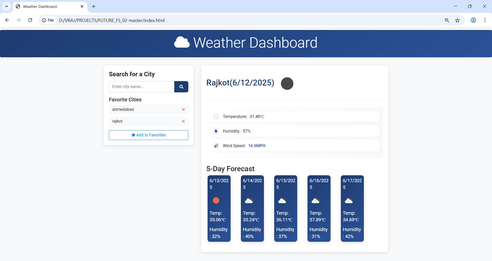

# Weather Dashboard ⛅

**Weather Dashboard** is a sleek and user-friendly web application that provides real-time weather data and forecasts for cities around the world. With a clean interface and instant search, users can easily view current conditions and upcoming weather details.

---

## 🌐 Live Preview
> *(Add live site link here if deployed, e.g., Vercel/Netlify)*  
Coming soon...

---

## ⚙️ Features
- 🔍 Search weather by city
- 🌡️ View current temperature, humidity, wind, and conditions
- 📅 5-day weather forecast
- 💾 Save favorite cities (optional/localStorage)
- 🎨 Clean and responsive UI

---

## 🛠️ Tech Stack

| Frontend      | Backend (Optional) | API Used             |
|---------------|--------------------|----------------------|
| React.js      | Node.js (if any)   | OpenWeatherMap API   |
| Tailwind CSS  | Express.js (opt)   |                      |

---
## 📸 Screenshots

